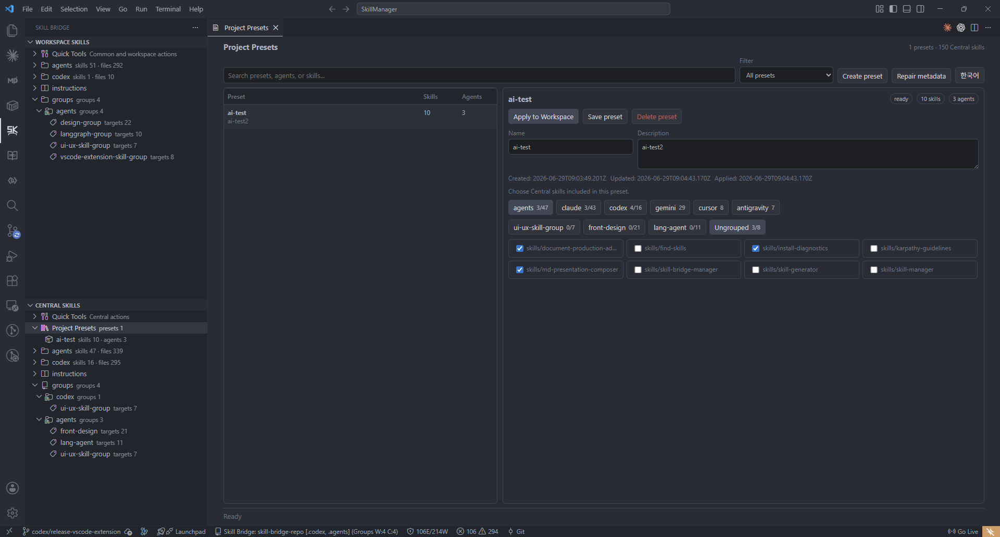
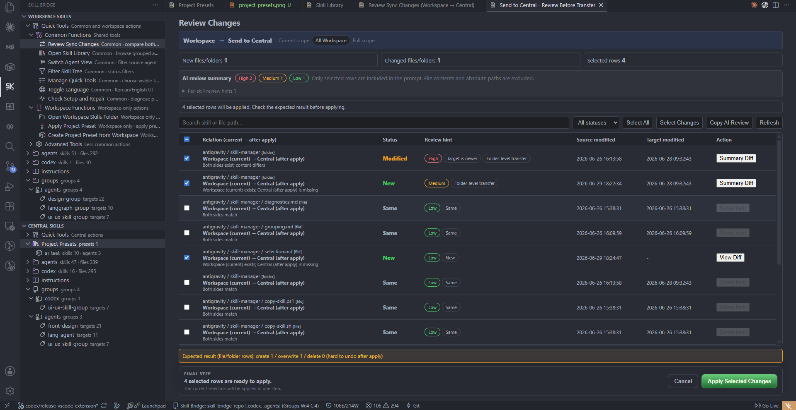

# Skill Bridge

한국어 문서는 [README.ko.md](README.ko.md)에서 볼 수 있습니다.

[Install from Visual Studio Marketplace](https://marketplace.visualstudio.com/items?itemName=datanewbie-labs.skill-bridge-vscode)

Skill Bridge is a VS Code extension for managing AI agent skill assets between a local workspace and a central Git-backed skill library.

It is built for users who want to reuse good agent skills without learning Git commands or manually copying folders between projects. A skill can start in one Workspace, move into Central after review, and come back into another project as a selected skill, group, or Project Preset.

**The core loop is simple.**

- **Find:** see Workspace and Central skills, groups, and presets together.
- **Review:** inspect changed files, risk hints, and diffs before anything is overwritten.
- **Apply:** bring selected skills or a Project Preset into the current project.
- **Update with agents:** install the bundled Skill Manager skill so an AI agent can help find, import, and refresh the right skills from Central.


_Compare Workspace and Central side by side before sending or bringing skills._

## Why It Matters

Agent skills improve as projects evolve, but they are easy to lose in local folders or overwrite by accident. Skill Bridge makes reusable skills visible, reviewable, and movable without becoming a skill runner, Git GUI, or auto-merge tool.

Users can see what is only in the Workspace, what already exists in Central, what changed, and which skills are safe to send or bring back before any file is overwritten.

The extension also includes a bundled **Skill Manager** skill. Once installed into a workspace, users can ask their AI agent to search the Central library, pick the skills needed for the project, bring them into `.agents`, `.codex`, `.claude`, `.gemini`, `.cursor`, or `.antigravity`, and update those skills later through the same reviewed Skill Bridge workflow.

| Downloadable skills | Reusable groups | Project presets |
| --- | --- | --- |
|  |  |  |

_Organize external skill packs, curated groups, and repeatable project setups around the Central library._

## Example: Bring The Right Skills Into This Project

> "Download the skills I need, then bring the right ones into this project."

Skill Bridge turns that into a reviewable workflow:

1. Compare Central and Workspace status in **Skill Library**.
2. Download or update reusable packs in **NPX Skill Library**.
3. Pick a project-ready bundle in **Project Presets**.
4. Check new files, changed files, risk hints, and expected results in **Transfer Review**.
5. Apply the selected rows and keep the result as a `Preset: <name>` group for later refreshes.



_Transfer Review provides the last visible checkpoint before files move._

## What It Does

- Browse Workspace and Central skills for Claude, Codex, Gemini, Cursor, Antigravity, and `.agents`.
- Send Workspace skills to Central after reviewing changes.
- Bring Central skills into a Workspace after reviewing changes.
- Compare Workspace and Central versions before copying.
- Manage reusable skill groups.
- Create and apply Project Presets for repeatable project setup.
- Install the bundled Skill Manager skill so an AI agent can help search Central, import selected skills, organize groups, and update them later.
- Inspect quality warnings such as missing `SKILL.md`, sensitive-looking text, scripts, broken links, and workspace-specific paths.
- Customize the Skill Bridge tree so beginners see only core tools while advanced users can enable more actions.

Skill Bridge is not a skill runner, not a Git GUI, and not an automatic merge tool. It is a skill asset bridge.

## Current Highlights At A Glance

| Capability | Why it matters |
| --- | --- |
| Two-side tree | Compare Workspace Skills and Central Skills in one view. |
| Transfer review | Confirm changed files before promoting or importing skills. |
| Project Presets | Store repeatable project setups in `.skillbridge/project-presets.json`. |
| Bundled Skill Manager | Let an AI agent help find, import, organize, and update skills from Central. |
| Quick Tools management | Keep the tree beginner-friendly while allowing advanced commands. |
| Multi-agent view | Manage multiple agent roots with the same review model. |
| Quality diagnostics | Surface actionable warnings in the native VS Code Problems view. |
| Agent instructions | Show instruction files separately from transferable skill folders. |
| Central-first library | Keep groups and presets in the configured Central library folder. |

## Supported Layouts

Skill Bridge treats each agent as a parallel skill store.

| Agent | Workspace root | Central root | Skill folder |
| --- | --- | --- | --- |
| Claude | `.claude/` | `claude/` | `skills/<skill-name>/SKILL.md` |
| Codex | `.codex/` | `codex/` | `skills/<skill-name>/SKILL.md` |
| Gemini | `.gemini/` | `gemini/` | `skills/<skill-name>/SKILL.md` |
| Cursor | `.cursor/` | `cursor/` | `skills/<skill-name>/SKILL.md` |
| Antigravity | `.antigravity/` | `antigravity/` | `skills/<skill-name>/SKILL.md` |
| Agents | `.agents/` | `agents/` | `skills/<skill-name>/SKILL.md` |

Only files under `skills/<skill-name>/...` are transferred as skills.

## Main Workflows

### Send Workspace Skills To Central

Use `Send to Central` or `Review Sync Changes` to review Workspace changes before copying them to the Central library.

Changed existing files go through diff review. New files can be copied directly after review. Skill Bridge never pushes Git remotes automatically.

### Bring Central Skills Into A Workspace

Use `Bring to Workspace`, `Download or Update Skill`, or `Apply Project Preset` to copy Central skills into the current workspace after review.

### Create And Apply Project Presets

Project Presets are Central-only reusable project setup templates.

- Create from selected Central skills.
- Create from the current Workspace.
- Export a Workspace group as a preset.
- Apply a preset to install its Central skills into the Workspace.
- Edit presets in the Project Presets overview.

Applying a preset records the result as a Workspace group named `Preset: <name>`.

### Manage Quick Tools

By default, Quick Tools shows a small set of essential commands. Use `Manage Quick Tools` to choose exactly which commands appear in the tree.

The selection is saved in `skillBridge.visibleQuickTools` and restored after reload.

### Switch Agent View

Use `Switch Agent View` to show one or more agents at the same time. Selecting all agents or none is treated as `All`.

The selection is saved in `skillBridge.visibleAgents`.

## Settings

The UI follows the VS Code display language. English and Korean are supported; other VS Code locales use English.

| Setting | Purpose |
| --- | --- |
| `skillBridge.centralRepoPath` | Central skill library path. Supports `${userHome}`, `${workspaceFolder}`, `${workspaceRoot}`, and `${env:NAME}`. The path must be reachable from the same host that runs the extension. |
| `skillBridge.defaultAgents` | Agents managed by Skill Bridge. |
| `skillBridge.visibleAgents` | Agents currently visible in the tree. Empty means all agents. |
| `skillBridge.visibleQuickTools` | Quick Tools commands visible in the tree. Empty means the default core tool set. |
| `skillBridge.autoSyncWorkspaceAgents` | Workspace agents that auto-sync changed skill folders to Central. |

## Project Structure

```text
skill-bridge/
├── apps/
│   └── vscode/         # VS Code extension
├── packages/
│   └── core/           # Shared core logic
├── AGENTS.md           # Project rules for AI agents
├── PLAN.md             # Product and UX plan
└── tsconfig.base.json
```

## Development

### Prerequisites

- Node.js 18+
- npm 9+

```bash
npm install
```

### Run In Development

```bash
npm run dev
```

Or run only the VS Code extension watcher:

```bash
cd apps/vscode
npm run watch
```

Then press `F5` in VS Code to launch the Extension Development Host.

## Build And Package

```bash
npm run typecheck
npm run build:vscode
npm --workspace apps/vscode run package:vsix
```

The VSIX is written to:

```text
apps/vscode/skill-bridge-vscode-<version>.vsix
```

Install it with:

```bash
code --install-extension apps/vscode/skill-bridge-vscode-<version>.vsix --force
```

After installing, run `Developer: Reload Window` in VS Code.

## License

MIT
