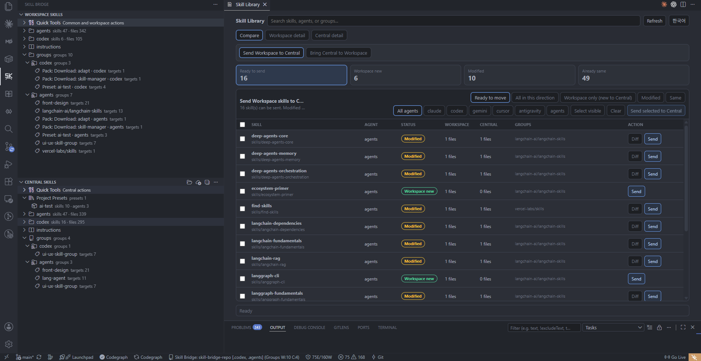
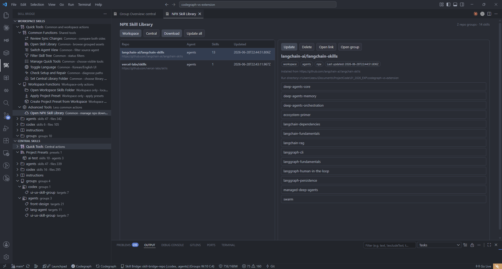
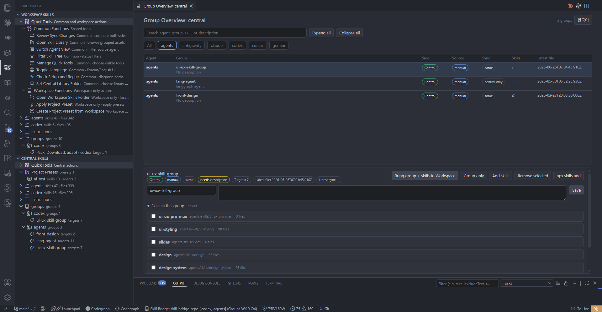

# Skill Bridge

Skill Bridge is a VS Code extension workspace for managing AI agent skill assets between a local workspace and a central Git-backed skill library.

It is built for users who want to reuse good agent skills without learning Git commands or manually copying folders between projects.



## Why It Matters

Skill Bridge makes reusable agent skills visible, reviewable, and movable. Users can see what is only in the Workspace, what already exists in Central, what changed, and which skills are safe to send or bring back before any file is overwritten.

| Library review | Skill groups |
| --- | --- |
|  |  |

## Example: Bring The Right Skills Into This Project

> "Download the skills I need, then bring the right ones into this project."

Skill Bridge turns that into a reviewable workflow: find reusable skills in Central, download or update them, apply a Project Preset or selected skills to the current Workspace, and leave the result as a `Preset: <name>` group so the project can be refreshed later.

## What It Does

- Browse Workspace and Central skills for Claude, Codex, Gemini, Cursor, Antigravity, and `.agents`.
- Send Workspace skills to Central after reviewing changes.
- Bring Central skills into a Workspace after reviewing changes.
- Compare Workspace and Central versions before copying.
- Manage reusable skill groups.
- Create and apply Project Presets for repeatable project setup.
- Inspect quality warnings such as missing `SKILL.md`, sensitive-looking text, scripts, broken links, and workspace-specific paths.
- Customize the Skill Bridge tree so beginners see only core tools while advanced users can enable more actions.

Skill Bridge is not a skill runner, not a Git GUI, and not an automatic merge tool. It is a skill asset bridge.

## Current Highlights

- **Two-side tree:** Workspace Skills and Central Skills are shown side by side in the Skill Bridge view.
- **Transfer review:** Promote and import flows open a review screen before overwriting changed files.
- **Project Presets:** Central stores reusable project setup templates in `.skillbridge/project-presets.json`; applying a preset creates or updates a Workspace group named `Preset: <name>`.
- **Quick Tools management:** The default tree shows only core actions. Use `Manage Quick Tools` to choose which tool commands appear.
- **Multi-agent view:** `Switch Agent View` supports selecting one or more agents, and the selection is remembered in `skillBridge.visibleAgents`.
- **Quality diagnostics:** actionable warnings appear in the native VS Code Problems view.
- **Agent instructions:** root instruction files and supported rule files are shown separately from transferable skill folders.
- **Central-first library:** Central groups and presets are stored in the configured Central library folder.

## Supported Layouts

Skill Bridge treats each agent as a parallel skill store.

| Agent | Workspace root | Central root | Skill folder |
| --- | --- | --- | --- |
| Claude | `.claude/` | `claude/` | `skills/<skill-name>/SKILL.md` |
| Codex | `.codex/` | `codex/` | `skills/<skill-name>/SKILL.md` |
| Gemini | `.gemini/` | `gemini/` | `skills/<skill-name>/SKILL.md` |
| Cursor | `.cursor/` | `cursor/` | `skills/<skill-name>/SKILL.md` |
| Antigravity | `.antigravity/` | `antigravity/` | `skills/<skill-name>/SKILL.md` |
| Agents | `.agents/` | `agents/` | `skills/<skill-name>/SKILL.md` |

Only files under `skills/<skill-name>/...` are transferred as skills.

## Main Workflows

### Send Workspace Skills To Central

Use `Send to Central` or `Review Sync Changes` to review Workspace changes before copying them to the Central library.

Changed existing files go through diff review. New files can be copied directly after review. Skill Bridge never pushes Git remotes automatically.

### Bring Central Skills Into A Workspace

Use `Bring to Workspace`, `Download or Update Skill`, or `Apply Project Preset` to copy Central skills into the current workspace after review.

### Create And Apply Project Presets

Project Presets are Central-only reusable project setup templates.

- Create from selected Central skills.
- Create from the current Workspace.
- Export a Workspace group as a preset.
- Apply a preset to install its Central skills into the Workspace.
- Edit presets in the Project Presets overview.

Applying a preset records the result as a Workspace group named `Preset: <name>`.

### Manage Quick Tools

By default, Quick Tools shows a small set of essential commands. Use `Manage Quick Tools` to choose exactly which commands appear in the tree.

The selection is saved in `skillBridge.visibleQuickTools` and restored after reload.

### Switch Agent View

Use `Switch Agent View` to show one or more agents at the same time. Selecting all agents or none is treated as `All`.

The selection is saved in `skillBridge.visibleAgents`.

## Settings

| Setting | Purpose |
| --- | --- |
| `skillBridge.centralRepoPath` | Central skill library path. Supports `${userHome}`, `${workspaceFolder}`, `${workspaceRoot}`, and `${env:NAME}`. |
| `skillBridge.defaultAgents` | Agents managed by Skill Bridge. |
| `skillBridge.visibleAgents` | Agents currently visible in the tree. Empty means all agents. |
| `skillBridge.visibleQuickTools` | Quick Tools commands visible in the tree. Empty means the default core tool set. |
| `skillBridge.language` | UI language, `en` or `ko`. |
| `skillBridge.autoSyncWorkspaceAgents` | Workspace agents that auto-sync changed skill folders to Central. |

## Project Structure

```text
skill-bridge/
├── apps/
│   └── vscode/         # VS Code extension
├── packages/
│   └── core/           # Shared core logic
├── AGENTS.md           # Project rules for AI agents
├── PLAN.md             # Product and UX plan
└── tsconfig.base.json
```

## Development

### Prerequisites

- Node.js 18+
- npm 9+

```bash
npm install
```

### Run In Development

```bash
npm run dev
```

Or run only the VS Code extension watcher:

```bash
cd apps/vscode
npm run watch
```

Then press `F5` in VS Code to launch the Extension Development Host.

## Build And Package

```bash
npm run typecheck
npm run build:vscode
npm --workspace apps/vscode run package:vsix
```

The VSIX is written to:

```text
apps/vscode/skill-bridge-vscode-<version>.vsix
```

Install it with:

```bash
code --install-extension apps/vscode/skill-bridge-vscode-<version>.vsix --force
```

After installing, run `Developer: Reload Window` in VS Code.

## License

MIT
